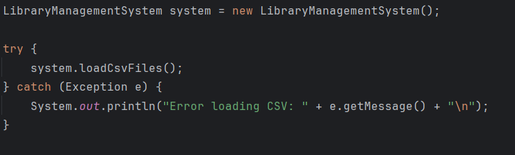
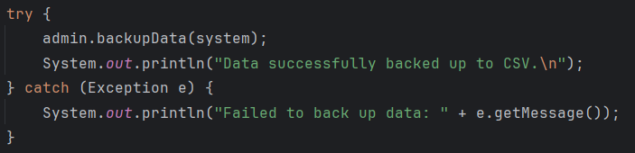
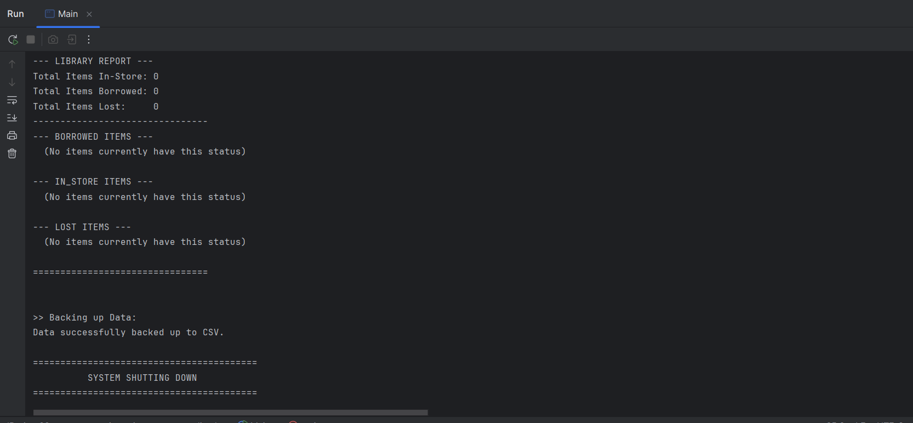

# Library Management System - User Guide
Welcome to the Library Management System. This guide provides an
overview of how to use the features of the application.

### 1. Data Loading
   To begin using the Library Management System, you must initialize the core system and load the 
   existing library data. The system reads from default CSV files to populate the users and items lists.
   

### 2. User Types and Restrictions
   The system supports three distinct types of users, each with specific borrowing rules:

   - Students: Can borrow a maximum of 5 books at a time (Books only)
   - Teachers: Have a higher limit and can borrow up to 10 items in total (Books, DVDs, or Magazines)
   - Admins: Have administrative privileges to back up data and generate reports

### 3. Borrowing and Returning Items
   Users can easily borrow and return items. The system automatically
   updates the item's status (example: IN_STORE -> BORROWED) and checks if the user 
   has reached their borrowing limit.
   
   Borrowing an Item:
   

If a user attempts to borrow an item that is already borrowed, lost, or exceeds their 
limit, the system will prevent the action and throw an ItemUnavailableException.

### 4. Searching for Items
   You can search the library's inventory by title or author. The search functionality is fully case-insensitive
   
   If the library owns multiple copies of the exact same item, the search result will 
   filter the results to only show one copy.
   
   You can choose between two search engines:
   - Stream-Based Search:
     // Searches the system using Java Streams
     List<Item> searchResults = system.searchItemStream("author");
   - Recursive Search:
     // Searches the system using a recursive algorithm
     List<Item> searchResults = system.searchItemRecursive("title");

### 5. Sorting
   The library can sort its internal lists of Users and Items using predefined sorting strategies
   system.sortItems() sorts by title using a bubble sorting algorithm
   system.sortUsers() sorts by name using a selection sorting algorithm
### 6. Admin Tools
   Admin users have access to exclusive management tools.
   Generating Reports: Admins can generate a comprehensive report detailing all 
   items in the system, organized by their status (Borrowed, In-Store, or Lost)
   

   Backing Up Data: Admins can securely back up the current state of the library. 
   This will export all user data and item inventory back into the .csv files.
